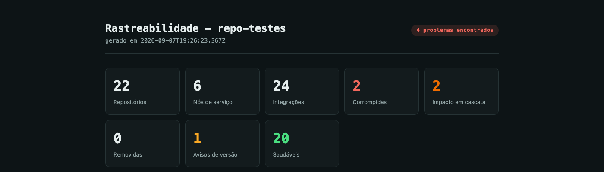
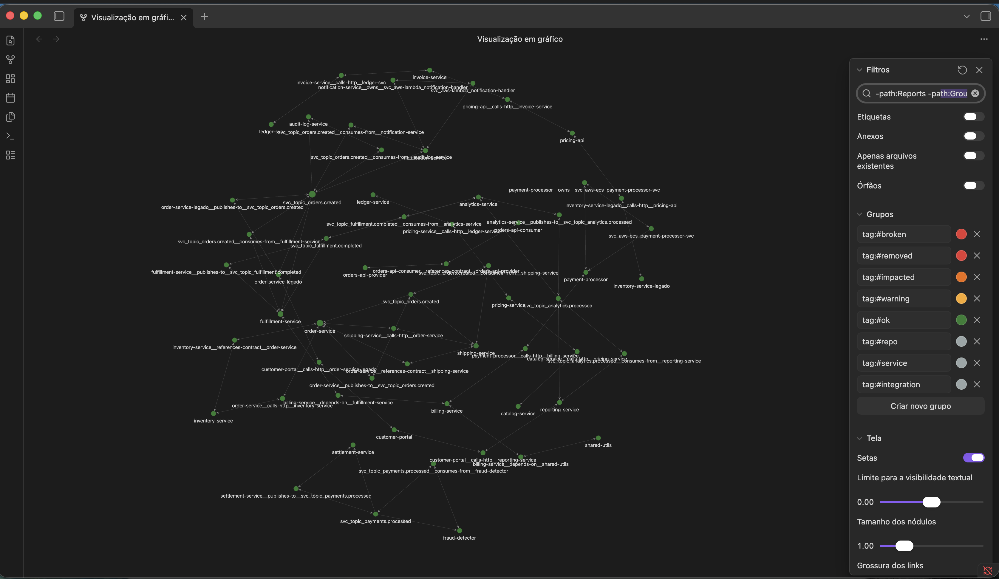
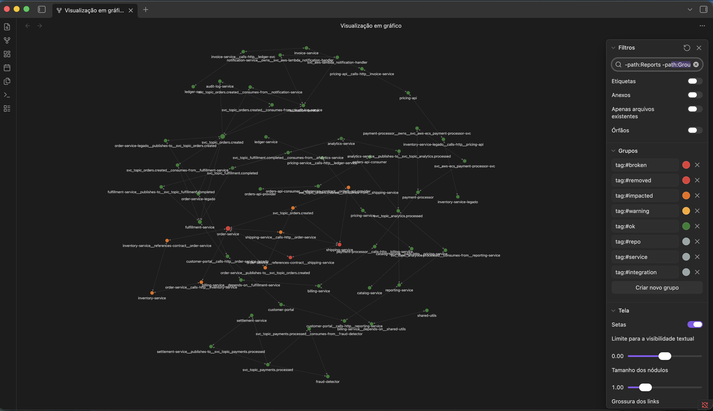
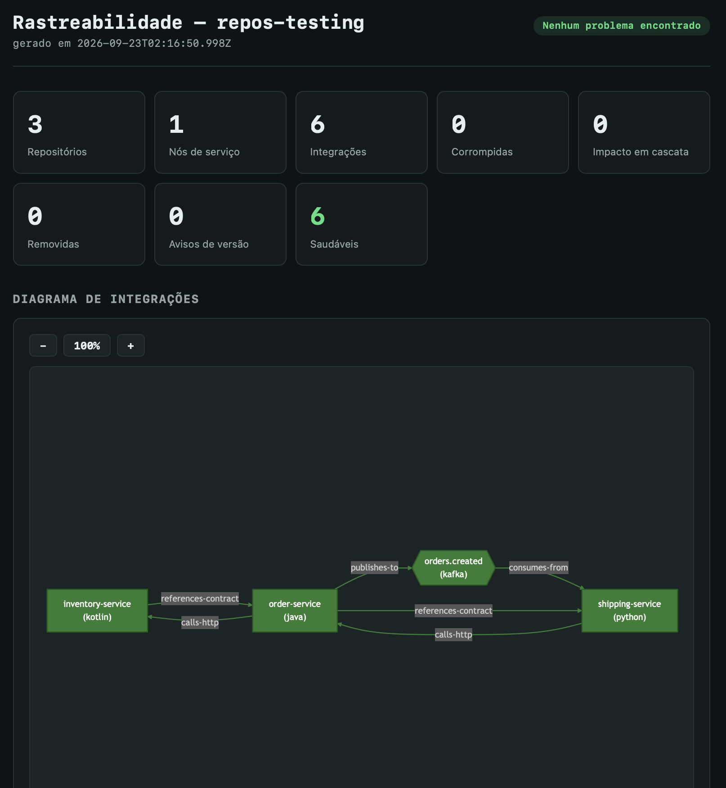
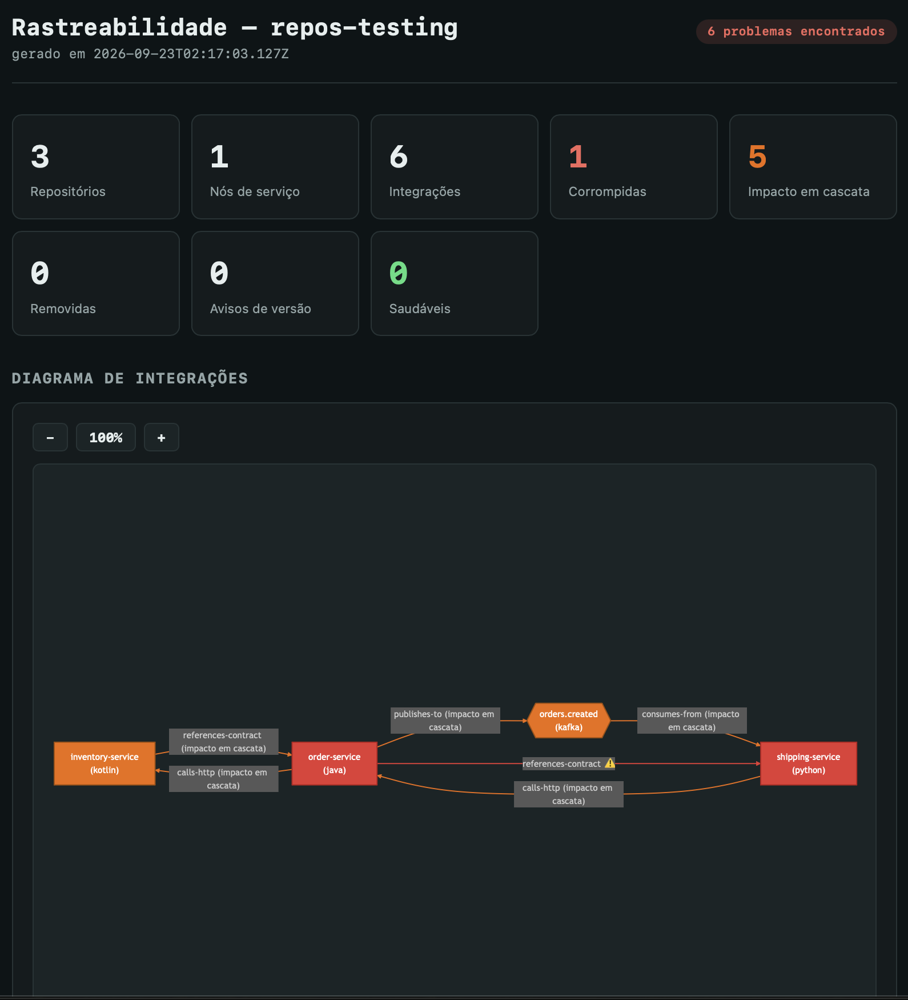
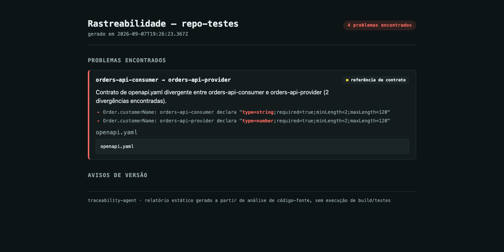
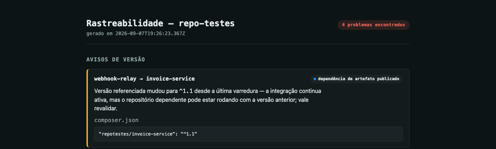

# traceability-agent

[](https://github.com/fecuencas/traceability-agent/actions/workflows/test.yml)

An [MCP](https://modelcontextprotocol.io) server that maps integrations across the multiple
repositories that make up one distributed system, detects breakage statically (no build/tests
required), and visualizes the whole thing as a graph. It speaks the Model Context Protocol, so it
works with **any MCP-compatible AI tool** — Claude Code, Claude Desktop, Cursor, Windsurf, or your
own MCP client — not just one vendor. Install it once, globally, and it's available from any
project on the machine.



## What it actually catches

Most integration diagrams are drawn by hand and go stale the day after they're drawn. This agent
re-derives the graph from the real source code on every run, and flags exactly what changed:

- **Cross-repo API contract breakage.** Two repositories each hold a copy of the same
  `openapi.yaml`/`swagger.json` (a provider and a client-generation copy, for example). The agent
  diffs the two copies field by field — type, `required`, `minLength`/`maxLength`, `pattern`,
  `minimum`/`maximum`, `enum` — and flags a real break the moment they diverge, down to which
  attribute changed and what each side declares.
- **Broken artifact dependencies.** A repo imports a class from a shared library that no longer
  exists in that library's current source — flagged without running a build.
- **Cascading impact.** When something breaks, everything transitively depending on it lights up
  too, with the correct direction per integration type (a broken queue affects consumers
  downstream; a broken HTTP dependency affects the caller, not the callee).
- **"Something changed, might be worth a look."** A dependency version bumped, or a contract with
  no known consumer changed shape — surfaced as a distinct **warning**, not lumped in with real
  breaks, because the dependent side may keep working fine on the old version.

Four-state color coding runs consistently through every surface: 🟢 healthy · 🟡 warning (changed,
not confirmed broken) · 🟠 cascading impact · 🔴 broken.

## Screenshots

<table>
<tr>
<td width="50%">

**Obsidian graph view, healthy** — every tracked repo colored green, node groups (broken/impacted/
warning/ok) configured as Obsidian graph groups so status is visible without opening a single note:



</td>
<td width="50%">

**Same graph, moments later** — a contract diverged between `order-service` and `shipping-service`;
both turn red and everything transitively connected to them turns orange:



</td>
</tr>
<tr>
<td width="50%">

**HTML report, same healthy state** — the self-contained report for the same 3-repo group shown
in the graph view above:



</td>
<td width="50%">

**HTML report after the break** — the same 3 repos, one broken contract, five integrations now
flagged as cascading impact:



</td>
</tr>
<tr>
<td width="50%">

**Field-level contract diff**, in the HTML report — the exact attribute that diverges is
highlighted, with each side's declaration on its own line:



</td>
<td width="50%">

**Version-change warning**, kept separate from real breaks:



</td>
</tr>
</table>

The same graph is also written as a full [Obsidian](https://obsidian.md) vault — a note per
repository, per integration, and per group, with a macro view (`index.md`) stitching every tracked
project together, so you can browse it interactively instead of only reading a static report.

## Install

Requires Node.js 18+.

```bash
git clone https://github.com/fecuencas/traceability-agent.git
cd traceability-agent
npm install
npm run build
```

### Make it available globally

```bash
npm link
```

This puts two commands on your `PATH`: `traceability-agent-mcp` (the MCP server itself) and
`traceability-agent` (a standalone CLI, useful for CI/pre-commit — see below). Any AI tool on the
machine can now point at `traceability-agent-mcp` without a hardcoded path into this repo.

### Register it with an MCP client

Any MCP-compatible client is configured the same general way — a JSON block naming the command to
launch over stdio:

```json
{
  "mcpServers": {
    "traceability-agent": {
      "command": "traceability-agent-mcp"
    }
  }
}
```

Where that JSON lives depends on the client:

| Client | Config location |
|---|---|
| Claude Code | `claude mcp add --scope user traceability-agent -- traceability-agent-mcp` |
| Claude Desktop | `claude_desktop_config.json` (Settings → Developer → Edit Config) |
| Cursor | `.cursor/mcp.json` (project) or `~/.cursor/mcp.json` (global) |
| Windsurf | `~/.codeium/windsurf/mcp_config.json` |
| Other MCP clients | Check the client's docs for its `mcpServers`-style config file |

Didn't run `npm link`? Use an absolute path instead of the bare command:
`"command": "node", "args": ["/absolute/path/to/traceability-agent/dist/server.js"]`.

## Getting started (first run)

Once the server is installed and registered (see [Install](#install) above), here's the whole flow
for a brand-new group of repositories:

1. **Open a terminal in the folder that contains the repositories** you want to track — the
   *parent* folder, not one specific repo. If `repo-a/`, `repo-b/` and `repo-c/` are siblings under
   `~/projects/my-system/`, that's where you `cd` to.
2. **Ask your AI assistant to map the integrations** — something like *"map the integrations
   between the repos in this folder"*. If your client supports it, this repo ships a Claude Code
   [Skill](https://github.com/anthropics/claude-code) (`~/.claude/skills/traceability/SKILL.md`)
   that knows exactly which tools to call and in what order, so a plain-language request is enough.
   Behind the scenes it runs `scan_repository` on each folder to detect language/build
   system/coordinates on its own — you don't type those by hand.
3. **No `.traceability/config.json` yet?** The assistant creates one at the root of that folder.
   Doing it by hand works too — see the format in [Using it in a project](#using-it-in-a-project)
   below. Add `"endpoints"` to a repo's entry if another repo in the group calls it over HTTP.
4. **Run the first scan**: ask for *"update the graph"* (`update_obsidian_graph` under the hood).
   This resolves the real integrations between the repos and writes the vault notes.
5. **Look at the result** — two options, pick whichever you have set up:
   - Open the vault in [Obsidian](https://obsidian.md) — by default it's the shared vault at
     `~/ObsidianVaults/traceability-vault/` (see [Using it in a project](#using-it-in-a-project)) —
     and switch a note to Reading mode to see the colored diagram.
   - Or skip Obsidian entirely: ask for *"generate the HTML report"*
     (`generate_html_report`) — a self-contained `.html` you can just open in a browser (the
     screenshots above are exactly this).
6. **From then on**, day to day:
   - Changed something in one of the repos and want to know what it affects? *"analyze the impact
     of this change in repo-a"* (`analyze_impact`).
   - Want the graph/report refreshed after new commits? Ask for *"update the graph"* again —
     it's safe to re-run any time, it always reflects the current state of the source code.

Installing and registering the server ([above](#install)) is one-time setup for the whole machine;
steps 1–6 here repeat for every new group of repositories you want to track.

## Using it in a project

The agent keeps no project state of its own — each project/monorepo that groups the repos to be
tracked gets its own `.traceability/config.json` at its root:

```json
{
  "groupId": "my-system",
  "repos": [
    { "id": "repo-a", "path": "./repo-a", "language": "java", "buildSystem": "maven", "coordinates": ["com.example:repo-a"] },
    { "id": "repo-b", "path": "./repo-b", "language": "node", "buildSystem": "npm", "coordinates": ["repo-b"] }
  ]
}
```

`path` is relative to the folder that contains `.traceability/`. Tools resolve this file relative
to the current working directory by default, or accept an explicit `configPath`. Graph state
(snapshots used for impact diffing) lives in `.traceability/state/` inside the tracked project
itself — never inside this package.

`groupId` and every `repos[].id` must match `^[A-Za-z0-9][A-Za-z0-9._-]*$` — letters, digits, `.`,
`_` and `-`, starting with a letter or digit. They're rejected otherwise, because both end up as a
file/folder name inside the vault (`Repos/<groupId>/<repoId>.md`); the same check applies to
`repoId` inside a `.traceability/manifest.json` (see `manifestPath`/`manifestsDir` below), which is
the more sensitive case since that file can be published by a sibling repo you don't control.

By default every group's notes go into one shared Obsidian vault
(`~/ObsidianVaults/traceability-vault/`), so you keep a single Obsidian window open and it stays
current with whatever project you last scanned — Obsidian only ever shows one fixed vault folder
per window, with no concept of "follow whatever folder was last active," so this is what lets the
same window show any project without you manually switching vaults each time. A lightweight index
at `~/.traceability-agent/registry.json` remembers which projects have been scanned (updated on
every `update_obsidian_graph`) — that's what the cross-project macro view (`index.md`) is built from.

Two groups never mix, even in the same vault: repo/service/integration notes live under their own
per-group folder (`Repos/<groupId>/<repoId>.md`, and likewise for `Services/`/`Integrations/`), so
two independent groups that happen to reuse the same id (two different systems each with an
`order-service`, say) never collide — they're simply different files. As a second line of defense,
the agent also refuses to overwrite any note whose frontmatter says it belongs to a different group
than the one currently being written (reported back as a `collisions` entry in the tool's response)
— this only matters for the residual case of two unrelated configs picking the exact same `groupId`
string.

### Giving a project its own vault (opt-in)

Add `"vaultPath": "./vault"` (resolved relative to the folder that contains `.traceability/`) when
you deliberately want to isolate one project — a client engagement you don't want appearing
alongside anything else, for example. That project's Obsidian window then only ever shows that one
system; you lose the shared macro view for it, and switch vaults manually in Obsidian to look at it
next to others.

Beyond this fully-centralized form, a group can also be described from manifests each repository
publishes on its own (`manifestPath`/`manifestsDir`) — no need for every repo to be checked out on
the same machine. See [`docs/decentralized-config.md`](docs/decentralized-config.md).

### Tools exposed over MCP

| Tool | What it does |
|---|---|
| `scan_repository` | Analyzes one repository in isolation, returns its detected integration signals |
| `map_integrations` | Resolves the whole group's graph (repos + edges) without touching the vault |
| `update_obsidian_graph` | Scans the group and writes/updates the Obsidian vault notes |
| `analyze_impact` | Diffs the current graph against the last saved snapshot for one repo, computes blast radius |
| `generate_impact_report` | Writes a Markdown impact report and annotates the affected integration notes |
| `generate_html_report` | Writes a self-contained HTML report (the screenshots above) |
| `generate_regression_tests` | Generates smoke tests for `published_artifact_dependency` integrations (JUnit5, Java/Kotlin so far) |
| `generate_overview_graph` | Regenerates just the cross-project macro view |

### Standalone CLI

MCP is how another AI tool talks to the agent — it's optional, not a requirement to use this at
all. Every day-to-day flow is also available straight from the terminal, no AI/MCP client in the
loop, useful for CI, a pre-commit hook, or just working locally:

```bash
traceability-agent scan . --repo-id my-repo                # analyze this repo alone, write manifest.json
traceability-agent update-graph [--config <path>] [--vault <path>]   # scan the group, write/update the vault
traceability-agent html-report [--config <path>] [--vault <path>]    # self-contained HTML report
traceability-agent impact --repo-id my-repo [--no-persist]           # diff + blast radius for one repo
traceability-agent impact-report --repo-id my-repo                   # write the Markdown impact report
```

Each subcommand calls the exact same underlying function as its MCP tool counterpart (see
`src/tools/*.ts`), so the CLI never drifts from what the agent does when an AI calls it. `scan`
analyzes the given path alone (no knowledge of sibling repos) and writes `.traceability/manifest.json`
— one building block of the decentralized/manifest-based setup above; the rest assume the current
directory is a tracked group's root (or `--config` pointing at one).

## Supported languages

| Language | Build system |
|---|---|
| Java | Maven |
| Kotlin | Gradle |
| Node.js / TypeScript | npm |
| Python | pip |
| Ruby | Bundler |
| C++ | CMake |
| Go | Go modules |
| C# / .NET | `*.csproj` |
| PHP | Composer |
| Rust | Cargo |

Each adapter detects the same signal types regardless of language: published artifact dependencies,
outbound HTTP calls, queue publish/consume, shared API contracts (OpenAPI/Swagger/`.proto`/`.avsc`),
and config-declared endpoints. Adding a new language follows
[`docs/adapter-authoring-guide.md`](docs/adapter-authoring-guide.md).

## Project structure

```
src/
├── server.ts        # MCP server entrypoint (stdio transport)
├── cli/              # standalone CLI (npm-linked as `traceability-agent`)
├── tools/            # one file per MCP tool, see table above
├── adapters/         # one analyzer per language/ecosystem
├── graph/            # graph construction, integrity checks, contract diffing, snapshot (de)serialization
├── obsidian/          # vault note generation (repo, integration, group, macro overview)
├── reports/           # self-contained HTML report
├── impact/            # snapshot diffing, blast radius
├── testgen/           # regression test generation
└── config/            # project config + global registry resolution
```

## Testing

```bash
npm test
```

Own test suite (`node:test`, no extra dependency), colocated with each module
(`src/<area>/<file>.test.ts`). Covers real bugs found and fixed during development — a sibling
group-id collision, directional cascade propagation, blast radius, service-node dedup across
cross-technology publishers/consumers, service nodes reconstructed when an infra resource
disappears from a scan, regex false-positives on a stub's own declaration, the OpenAPI field-level
diff described above, and a path-traversal attempt via a malicious `groupId`/`repoId` (config or
manifest) rejected before it can write outside the vault.

## Security

Found a security issue? See [SECURITY.md](SECURITY.md) for how to report it.

## Contributing

See [CONTRIBUTING.md](CONTRIBUTING.md) for how to build, test, and open a PR.

## License

Copyright (c) 2026 Fernando Cuencas

This project is licensed under the MIT License. See the [LICENSE](LICENSE) file for details.
